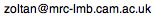

# zentracker
A simple and user-friendly multiworm tracker. Can be used as an analysis toolkit for extracting morphological and behavioural data from videos of objects moving in a 2D environment.

### Compiled version

For 64-bit Windows, see there is a [compiled version available](https://github.com/zolts/zentracker/tree/master/bin/2.14/win64) that does not require MATLAB (only a freely available runtime environment).

### Source code

The [source code is available](https://github.com/zolts/zentracker/tree/master/source), which can be used to run the program within MATLAB under various platforms, including Windows and Mac OS X.

### Contact

For any questions about the use or reuse of the program, please contact 

If you encounter any problems with the program, have any suggestions, or would like to see some new feature implemented, you can leave a note on the [issues page](https://github.com/zolts/zentracker/issues).
